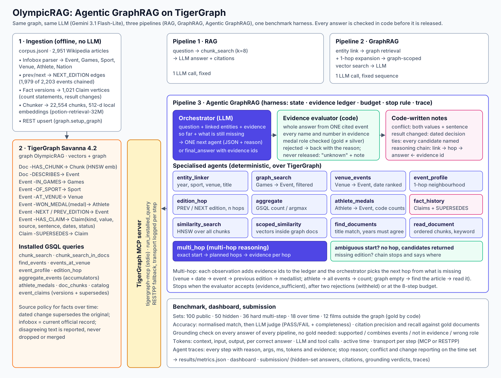

# OlympicRAG: when does a question need an agent?

**Live dashboard:** https://nirmaljosephukken.github.io/olympicrag-agentic-graphrag/dashboard/ · **Demo video:** (link to be added) · **Writeup:** [docs/writeup.md](docs/writeup.md)

Three pipelines answer the same questions over the same TigerGraph graph with the same LLM:

| Pipeline | What it does | LLM calls |
|---|---|---|
| **RAG** | vector search over all 22,554 chunks → answer | 1 |
| **GraphRAG** | entity linking → fixed graph retrieval + 1-hop expansion → graph-scoped vector search → answer | 1 |
| **Agentic GraphRAG** | an orchestrator LLM picks one specialised agent at a time based on the evidence so far, an evidence evaluator checks grounding before it may stop | 2–8 |

Built by Amal Francis V Ukken for the TigerGraph **Agentic GraphRAG Hackathon** (Round 1) on the provided corpus: 2,951 Wikipedia articles (Olympic events 1988–2022, plus films and people), 100 public and 50 hidden questions, plus three sets of our own: 36 harder multi-step questions, 18 reasoning-over-time questions (conflicting and superseded facts) and 12 questions about films that are not in the graph.



## Results

All agent numbers below come from the final system (with the fact-history agent), with graph queries sent through the TigerGraph MCP server.

### 100 public questions

| Pipeline | Accuracy | Completeness | Citation recall | Tokens / question | Tokens / correct answer | LLM calls | Active time |
|---|---|---|---|---|---|---|---|
| RAG | **47%** | 0.53 | 0.42 | 3,116 | 6,629 | 1.00 | 3.6 s |
| GraphRAG | **65%** | 0.73 | 0.58 | 2,364 | 3,638 | 1.00 | 3.8 s |
| Agentic GraphRAG | **99%** | 0.99 | 0.88 | 3,095 | 3,126 | 2.04 | 7.2 s |

| Type | RAG | GraphRAG | Agentic | Verdict |
|---|---|---|---|---|
| aggregation (21) | 0% | 29% | 100% | **agent needed**. In 14 of GraphRAG's 15 misses every relevant event and its competitor count was in its context; the LLM miscounted. The agent counts in GSQL. |
| lookup (19) | 63% | 100% | 100% | GraphRAG is enough, and cheaper (1,645 against 3,028 tokens) |
| multi-hop (28) | 64% | 100% | 96% | GraphRAG is enough, and cheaper (1,894 against 3,101 tokens). The agent's one miss, pub-028, is ambiguous in the corpus (three finals share the exact venue and date text). |
| superlative (10) | 30% | 100% | 100% | GraphRAG is as accurate and cheaper (2,575 against 3,041 tokens) |
| temporal (22) | 64% | 9% | 100% | **agent needed**. GraphRAG's fixed retrieval fetches the year named in the question, so the previous Games' winner never reaches its context. |

Per question the agent costs about as much as RAG (3,095 against 3,116 tokens) and more than GraphRAG (2,364). Per correct answer it is the cheapest of the three (3,126, against 3,638 for GraphRAG and 6,629 for RAG). Its cost grew as we added the fact-history and multi-hop agents (2,374 tokens per question before either): the orchestrator's instructions are longer and a multi-hop observation carries every hop. Accuracy did not change.

### 36 harder multi-step questions (our own set)

Built by `scripts/make_hard_questions.py` from the same corpus. Every gold answer is computed by code from the parsed infoboxes, or (5 text-only questions) read from the article text with the quote recorded. None is written by an LLM, and names that a reader could confuse with another medallist are excluded.

| Pipeline | Accuracy | Completeness | Citation recall | Tokens / question | Tokens / correct answer | LLM calls | Active time |
|---|---|---|---|---|---|---|---|
| RAG | **33%** | 0.37 | 0.39 | 3,136 | 9,408 | 1.00 | 3.3 s |
| GraphRAG | **33%** | 0.37 | 0.36 | 2,199 | 6,596 | 1.00 | 3.4 s |
| Agentic GraphRAG | **100%** | 1.00 | 0.74 | 4,584 | 4,584 | 2.83 | 8.9 s |

| Type | RAG | GraphRAG | Agentic | What it needs |
|---|---|---|---|---|
| athlete count (5) | 0% | 0% | 100% | athlete → all medal events → exact count |
| compare (5) | 40% | 100% | 100% | two event lookups → compare |
| next edition (5) | 60% | 0% | 100% | event at YEAR → next edition |
| silver venue (4) | 50% | 100% | 100% | venue + date → event → silver (not gold) |
| text only (5) | 60% | 0% | 100% | no infobox: graph finds nothing → find the article → read its medal line |
| two editions back (6) | 17% | 0% | 100% | event at YEAR, then two editions back (the 1994 Winter Games break the 4-year pattern) |
| venue then previous (6) | 17% | 50% | 100% | venue + date → event → previous edition |

Here the agent takes real multi-step routes: `link > multi_hop` (10: one call resolves the start event and walks the planned hops), `link > athlete_medals` (5), `link > event_profile > event_profile` (5, two lookups then a comparison), `link > graph_search > find_documents > event_profile > read_document` (5, when the graph has no event for the article), `link > venue_events > event_profile` (4) and `link > venue_events > multi_hop` (2).

### 18 reasoning-over-time questions (our own set)

Built by `scripts/make_time_questions.py`. Each question is about a fact with more than one version in the corpus; every gold answer is the quoted article sentence or the infobox field it comes from.

| Type | RAG | GraphRAG | Agentic | What it needs |
|---|---|---|---|---|
| original (5) | 80% | 100% | 100% | who won before the result was changed (article text) |
| current (5) | 100% | 100% | 100% | who is credited now (the official record) |
| when (2) | 100% | 100% | 100% | the year a dated decision changed the result |
| vacant (1) | 0% | 100% | 100% | the official record leaves the gold vacant |
| count conflict (5) | 60% | 80% | 100% | the infobox and the text disagree: use the official record and report the conflict |
| **all (18)** | **78%** | **94%** | **100%** | |
| conflict reported (both values shown) | 0/5 | 4/5 | 5/5 | |
| result change noted | 0/13 | 11/13 | 13/13 | |

GraphRAG gets most of these right because they name a single event and its retrieval includes the event profile, which flags the versions. The agent adds the `fact_history` call and always reports both versions.

### 12 questions outside the graph: films (our own set)

The graph models Olympic events, but the corpus also holds 546 film articles. Built by `scripts/make_open_questions.py`: each question describes a film without naming it (year, director, one star), so the graph has nothing and title matching cannot find it. The article has to be found by meaning, which is the job of similarity search. Gold answers are taken by code from the film infobox, only from films whose director is unique in the corpus.

| Pipeline | Accuracy | Completeness | Citation recall | Tokens / question | Tokens / correct answer | LLM calls |
|---|---|---|---|---|---|---|
| RAG | **100%** | 1.00 | 1.00 | 2,684 | 2,684 | 1.00 |
| GraphRAG | **58%** | 0.58 | 0.58 | 3,218 | 5,517 | 1.00 |
| Agentic GraphRAG | **100%** | 1.00 | 1.00 | 7,002 | 7,002 | 3.58 |

| Type | RAG | GraphRAG | Agentic | What it needs |
|---|---|---|---|---|
| identify (4) | 100% | 25% | 100% | find the film from its description, answer its name |
| composer (4) | 100% | 100% | 100% | find the film, read the music credit |
| camera (4) | 100% | 50% | 100% | find the film, read the cinematography credit |

**Here the agent is overkill.** When the answer sits in one article that a description can find, plain RAG is as accurate at 38% of the agent's token cost. GraphRAG's 58% follows one exact pattern: it fails on every question whose year is an Olympic year (1992, 2002, 2004) and answers every other one correctly. GraphRAG searches only inside the articles the graph points to. For "the 2002 film directed by Kunal Kohli" the only entity the graph recognises is the year, so it returns 40 events of the 2002 Winter Olympics and the vector search is restricted to their articles; the film can never be reached and GraphRAG correctly answers "unknown" (5 times). In a non-Olympic year the graph finds nothing, GraphRAG falls back to searching the whole corpus, and it gets all 7 right. This is GraphRAG's blind spot: it trusts the graph's view of the question, which helps when the answer is in the graph and hurts when it is not. The agent sees that the graph has nothing relevant and searches the corpus instead. The agent gets every answer right and grounded, but spends 3.6 LLM calls: on 4 questions it went straight to `similarity_search`; on 8 it first tried matching article titles (`find_documents`), which rarely works without a title. Six of those then switched to `similarity_search`, and two found the article through a partial title match and read it. Most common paths: `link > similarity_search` (4) and `link > find_documents > find_documents > similarity_search` (3). The agent's active time on this set is not comparable with the other sets, because the LLM provider was throttling requests during the run.

### Reproducibility: a second complete run

We ran every pipeline on every question set (216 questions, all three pipelines) a second time, independently, with the same code, graph and LLM, into `results_confirm/`. `scripts/compare_runs.py` compares the two runs question by question; the full report is `results_confirm/comparison.md`. The numbers above are from the first run.

| Pipeline | Same answer in both runs (216 questions) | Public accuracy, run 1 / run 2 | Hard | Time | Films |
|---|---|---|---|---|---|
| RAG | 206 | 47% / 47% | 33% / 33% | 78% / 72% | 100% / 100% |
| GraphRAG | 191 | 65% / 62% | 33% / 33% | 94% / 100% | 58% / 58% |
| Agentic GraphRAG | **216** | 99% / 99% | 100% / 100% | 100% / 100% | 100% / 100% |

The agent gave the same answer to every question in both runs, and every answer was grounded both times. GraphRAG changed 25 answers, most of them counts (for example 8 in run 1 and 7 in run 2 for the same question): it asks the LLM to count, and the LLM counts differently each time, while the agent counts in GSQL. One time-set question shows the conflict problem directly: for the 2016 men's triple jump, where the infobox says 48 competitors and the article text says 47, RAG answered 48 in one run and 47 in the other, and GraphRAG did the opposite; the agent answered 48, the official record, both times and reported the conflict.

### Grounding check on every answer

`agr/grounding.py` checks in code whether each answer is fully supported by ONE cited evidence item. It needs no ground truth, so it covers the hidden set too.

| Set | Pipeline | Supported by one source | Combines events | Not in evidence | Wrong medal role | Unknown |
|---|---|---|---|---|---|---|
| public (100) | RAG | 69 | 0 | 11 | 1 | 19 |
| public (100) | GraphRAG | 57 | 0 | 21 | 2 | 20 |
| public (100) | Agentic GraphRAG | 100 | 0 | 0 | 0 | 0 |
| hidden (50) | RAG | 31 | 0 | 6 | 0 | 13 |
| hidden (50) | GraphRAG | 27 | 0 | 15 | 0 | 8 |
| hidden (50) | Agentic GraphRAG | 50 | 0 | 0 | 0 | 0 |
| hard (36) | RAG | 17 | 0 | 4 | 0 | 15 |
| hard (36) | GraphRAG | 10 | 0 | 5 | 0 | 21 |
| hard (36) | Agentic GraphRAG | 36 | 0 | 0 | 0 | 0 |
| time (18) | RAG | 14 | 0 | 1 | 0 | 3 |
| time (18) | GraphRAG | 15 | 0 | 3 | 0 | 0 |
| time (18) | Agentic GraphRAG | 18 | 0 | 0 | 0 | 0 |
| films (12) | RAG | 12 | 0 | 0 | 0 | 0 |
| films (12) | GraphRAG | 7 | 0 | 0 | 0 | 5 |
| films (12) | Agentic GraphRAG | 12 | 0 | 0 | 0 | 0 |

"Correct" and "grounded" measure different things. GraphRAG has 65 correct public answers but 57 grounded ones: six correct counts were the LLM's own arithmetic (the number is stated in no evidence), and two correct names were cited to the wrong event (for example, the 2012 pole vault champion cited to the 2016 event, where he won silver). The agent's stop rule only accepts grounded answers. One hard question shows the rule working: in an earlier run the agent passed an article title where an id was expected, found nothing, and tried to answer from memory; the check rejected it and the result was released as "unknown". The tool now resolves titles exactly, and the question is answered from the article.

Hidden set: all 50 questions answered by all three pipelines. "Unknown" answers: RAG 13, GraphRAG 8, Agentic GraphRAG 0, and all 50 agent answers pass the grounding check. `submission/` holds the outputs per pipeline with answers, citations, code-written notes, grounding verdicts, tokens and the agent's full traces, plus `hidden_answers.csv` side by side.

**TigerGraph MCP**: in the final agent runs on all five sets, the GraphRAG run on the hard set and all time-set and film-set runs, all 420 logged graph steps went through the MCP server, with no fallback to RESTPP. (The other RAG and GraphRAG runs predate the MCP transport and used RESTPP directly; the queries are the same.)

LLM: Gemini 3.1 Flash-Lite for all pipelines and as judge. A free normalised match settles most answers (team answers match as a set of names, whatever the separators); the LLM judge only sees the rest, a verdict is reused when exactly the same answer was judged before, and a rule fails any answer that names more people than the gold answer.

Full interactive dashboard: [`dashboard/index.html`](dashboard/index.html) (open locally) or live at **https://nirmaljosephukken.github.io/olympicrag-agentic-graphrag/dashboard/** (scorecard, grounding, accuracy and tokens by question type, the harder, reasoning-over-time and film sets, agent behaviour, and every question with its full agent trace).

## Design

### 1. Ingestion without an LLM
Most articles start with an infobox (`[Infobox Olympic event]` followed by `key: value` lines). `agr/parse.py` turns those into
graph entities deterministically: **Event, Games, Sport, Venue, Athlete, Nation**, and resolves the infobox `prev` / `next`
years into **NEXT_EDITION / PREV_EDITION** edges between the same event at consecutive Games (1,979 of 2,203 events chained).
Tennis articles carry the Olympic infobox as a second infobox, and team tournaments (football, handball, hockey, water polo, rugby)
use their own infobox formats; both are mapped onto the same Event fields, copying only fields that exist (a team champion stays a
team code such as `USA`; a football `venues: 7` count is never stored as a venue name). Six cycling articles have no infobox and stay text-only.
Medal fields become Athlete vertices only when they split safely: on commas, semicolons, "and" or names stored run together
(`Dani KingLaura Trott`), after removing `*` marks, footnotes and glued country codes. A team written without separators
(`Viktor Ahn Semion Elistratov ...`) creates no Athlete vertices at all, so no person is ever invented by guessing a split.
No extraction tokens are spent and no edge is hallucinated. Every article (Olympic or not) is also split into paragraph-aware
chunks (title-prefixed, ~1,100 characters) stored as `Chunk` vertices with a 512-d vector in TigerGraph's HNSW index.

Embeddings use the static retrieval model `minishlab/potion-retrieval-32M` (model2vec): ~2,000 chunks/s on a laptop CPU,
no GPU or API key, identical vectors on every machine. (A transformer embedder ran at ~1 chunk/s on the 2-core build box.)

### 2. One TigerGraph graph for vectors and structure
`graph/schema.gsql` creates graph-local types in graph `OlympicRAG`:

```
Doc -HAS_CHUNK-> Chunk(text, emb VECTOR 512 COSINE)      Doc -DESCRIBES-> Event
Event -IN_GAMES-> Games   Event -OF_SPORT-> Sport   Event -AT_VENUE-> Venue
Event -WON_MEDAL(medal)-> Athlete   Event -MEDAL_FOR(medal)-> Nation
Event -NEXT_EDITION-> Event (reverse PREV_EDITION)   Games -NEXT_GAMES-> Games
Event -HAS_CLAIM-> Claim(kind, attribute, value, source, sentence, dates, status)   Claim -SUPERSEDES-> Claim
```

`graph/queries.gsql` installs the retrieval primitives the agents use: `chunk_search` (vectorSearch),
`chunk_search_in_docs` (vectorSearch restricted to a graph-selected candidate set), `find_events`, `events_at_venue`,
`event_profile`, `edition_hop`, `aggregate_events` (count / argmax with GSQL accumulators), `doc_chunks`, `athlete_medals`, `catalog`,
and `event_claims` (every version of an event's facts and which one supersedes which).

### 3. TigerGraph MCP
With `TG_TRANSPORT=mcp`, every installed query the agents run goes through the official TigerGraph MCP server
([`tigergraph-mcp`](https://github.com/tigergraph/tigergraph-mcp)). `agr/mcp_bridge.py` launches it over stdio, discovers its tools
with `list_tools` and calls its `run_installed_query` tool, reading the argument names from the tool's schema at runtime. If the
server is missing or a call fails, the query falls back to RESTPP, and each trace step records which transport served it
(`via: mcp` or `via: rest(fallback: ...)`), so MCP use is reported, not assumed. In the final agent runs MCP served every graph step (see Results).

### 4. Reasoning over time: conflicting and superseded facts
Some facts in the corpus have more than one version, and `agr/temporal.py` finds them with code (no LLM):
* **Result changes**: 252 event articles say a medallist "originally won", was disqualified, stripped or re-tested, or that medals
  were reallocated. The infobox holds the current official result; the text holds the original one and the dated decision.
* **Count conflicts**: the infobox gives competitors and nations, and the text often restates them ("Forty-two athletes from 32
  nations competed"). Ten events disagree. Counts for one round ("in the final") and units that are not people (pairs, boats) are skipped.

Ingestion stores each version as a `Claim` vertex (1,021 in all) linked to its event, with a `SUPERSEDES` edge from a dated change
to the original result. The source policy is explicit and enforced in code: a dated change supersedes the original result; the
infobox is the current official record; a disagreeing statement is reported with its exact sentence, never dropped and never merged
into the answer. `event_profile` flags an event whose facts have several versions, the `fact_history` agent returns all of them with
the resolution, and the harness writes a note naming both versions (for example "the official record (43/33) and the article text
('Forty-two athletes from 32 nations competed.', i.e. 42/32) disagree. The answer uses the official record.").

### 5. The agent harness (`agr/pipelines.py`)
* **State**: question, linked entities, an evidence ledger (every fact or chunk gets an id like `E12` with its source document),
  step budget (8), token and time accounting.
* **Orchestrator**: one LLM call per step returns JSON `{reasoning, action, args}` or `{final_answer, citations}`. Its next
  move depends on the question, the linked entities, what earlier steps returned and what is still missing. There is no fixed
  sequence. On 99 of the 100 public questions one call was enough (`aggregate` 31, `venue_events` 28, `multi_hop` 21,
  `event_profile` 19). On the harder set it chains steps (`venue_events > multi_hop`, two `event_profile` lookups then a
  comparison, `graph_search > find_documents > event_profile > read_document` after the graph comes back empty).
* **Specialised agents** (`agr/tools.py`), all deterministic and cheap: entity linking, graph traversal (`graph_search`,
  `venue_events`, `event_profile`, `edition_hop`, `athlete_medals` with medal counts computed in code), similarity search
  (global and graph-scoped), document linking (`find_documents`, title match) and document retrieval (`read_document`, optionally
  only the passages containing a keyword such as "Gold"), graph-native aggregation, and the fact-history agent.
* **Multi-hop reasoning agent** (`multi_hop`): the orchestrator plans a chain and this agent executes it in the graph. It resolves
  ONE start event exactly (by id, by venue + date, or by sport + year + event name), then walks the planned hops along the
  NEXT/PREV_EDITION edges one at a time, returning the event reached at every hop as its own evidence item. If the start is
  ambiguous (several events match the venue and date equally) it takes no hop and returns the candidates, so it never guesses; if
  an edition is missing (the 1994 Winter Games break the four-year pattern, which the edges already encode), the chain stops and says
  where. `tests/test_multi_hop.py` covers these cases without a network.
* **Evidence evaluator** (`agr/grounding.py`, enforced in code, not by the LLM): before the agent may stop, the whole answer
  must be supported by ONE cited evidence item. It rejects an answer that (1) combines facts from different events, (2) contains a
  name or number that no cited evidence states (a count must equal the aggregation agent's count, not any number in the text),
  or (3) names a silver/bronze medallist as the gold winner (medal tables in article text are read by position, not by
  "the name appears after the word Gold"). A rejected answer goes back to the orchestrator with the reason (up to two times),
  and a rejected answer is never released: if no grounded answer arrives, the result is "unknown" with a code-written note. When several events match a question equally (same venue and identical date text), the agent answers for one,
  with low confidence, and the harness attaches a **code-written** note naming all candidates. Ambiguity is reported, never merged.
* **Argument grounding**: tool arguments stay faithful to the question (the verbatim date phrase found by the entity linker is
  restored if the LLM shortens it); titles passed instead of ids are resolved exactly, never fuzzily.
* **Multi-hop reasoning chain**: each answer carries a reasoning chain built by code from the trace, one line per hop
  (`linked: years=[2004], ...` → `venue 'X' + date 'Y' -> 1 event(s): ...` → `prev edition of Q... -> 1 event(s): ...` →
  `answer 'Z' <- E7 (title)`), so a reader can
  follow every hop back to the evidence item it rests on.
* **Code-written notes**: conflicts (both versions with the sentence), result changes (the dated decision) and ties (every candidate
  event) are reported in notes the LLM cannot edit.
* **Strategy changes** are recorded when a tool comes back empty and the agent switches to a different retrieval family.
* **Stop reason** is logged for every question (`evidence_sufficient`, `withheld_after_review`, `step_budget_exhausted`).

### 6. Benchmark (`agr/benchmark.py`)
For every question and pipeline: answer, citations, LLM input / output tokens (including thinking tokens), context tokens,
LLM and tool calls, per-step time and tokens, chunks retrieved, strategy changes and stop reason.
Accuracy is graded with a free normalised match first and an LLM judge (PASS/FAIL + completeness) for the rest.
Citation precision / recall are computed against the gold documents. The same grounding check runs on every answer of every
pipeline (public and hidden) to count unsupported, combined and wrong-role answers; this needs no ground truth.
`tests/` holds regression tests built from the real failures we found (merged events, run-together team names, wrong medal role,
a number from a date passing as a count, tennis infoboxes missed by the parser). Latency is reported as active time (tool + LLM time),
so free-tier rate-limit waits do not distort the comparison.

## Run it

```bash
pip install -r requirements.txt
cp .env.example .env            # TigerGraph Savanna host + secret, Gemini key
# put the hackathon dataset in data/ (corpus/corpus.jsonl, questions/*.jsonl)

python -m agr.parse data/corpus/corpus.jsonl build   # ~10 s, no LLM
python -m agr.embed build                            # ~15 s on CPU
python -m graph.setup_graph                          # schema, load ~32k vertices, install queries (~6 min)

python -m agr.ask "Who won the gold medal in the men's pole vault at the Summer Olympics held immediately before 2016?"
python scripts/make_hard_questions.py                # our harder multi-step set (gold computed by code)
python scripts/make_time_questions.py                # reasoning-over-time set (gold quoted or computed by code)
python scripts/make_open_questions.py                # film questions outside the graph (gold from infoboxes, by code)
export TG_TRANSPORT=mcp                              # optional: every graph query through the TigerGraph MCP server
python -m agr.benchmark run --split public --pipelines rag,graphrag,agentic   # resumable
python -m agr.benchmark run --split hard   --pipelines rag,graphrag,agentic
python -m agr.benchmark run --split time   --pipelines rag,graphrag,agentic
python -m agr.benchmark run --split open   --pipelines rag,graphrag,agentic
python -m agr.benchmark run --split hidden --pipelines rag,graphrag,agentic
for s in public hard time open; do python -m agr.benchmark judge --split $s; done
python -m agr.benchmark report                       # results/metrics.json
RESULTS_DIR=results_confirm scripts/final_runs.sh    # optional: a second, independent run
python scripts/compare_runs.py results results_confirm
python -m agr.dashboard                              # dashboard/index.html
python -m agr.submission                             # submission/ (hidden-set outputs)
python -m pytest -q tests
```

`LLM_MIN_INTERVAL=4.2` paces calls for a free-tier Gemini key (15 requests/minute, 500/day); `GEMINI_API_KEYS=key1,key2` rotates
keys when one key's daily quota is used up (detected from the retry delay, not from the error text).

## Repository

```
agr/parse.py        infobox parser, chunker, edition linking
agr/embed.py        local embeddings
agr/tg.py           TigerGraph client (token, GSQL, upserts; installed queries over MCP or RESTPP)
agr/mcp_bridge.py   TigerGraph MCP client (stdio, tool discovery, run_installed_query)
agr/temporal.py     fact versions: count statements, result changes, source policy
agr/tools.py        specialised agents (one Observation + evidence ids per call)
agr/pipelines.py    harness, RAG, GraphRAG, Agentic GraphRAG
agr/grounding.py    code grounding check (one source, no unsupported content, medal role)
agr/benchmark.py    runner, judge, metrics report
agr/dashboard.py    builds dashboard/index.html from results/metrics.json
agr/submission.py   packages the hidden-set outputs
agr/ask.py          ask one question and print the full trace
graph/              schema.gsql, queries.gsql, setup_graph.py
scripts/            make_hard_questions.py, make_time_questions.py, make_open_questions.py, final_runs.sh, compare_runs.py
mcp/proxy_shim/     lets the MCP server use an HTTPS proxy (only needed in sandboxed networks)
tests/              regression tests built from real failures (grounding, parser, matching)
results_confirm/    a second complete run of everything, and comparison.md (reproducibility)
results/            raw outputs per pipeline and split with full traces, judged files, metrics.json, archives of earlier runs
submission/         hidden-set outputs for submission
docs/               architecture diagram, demo script, writeup and social post
```

## Limitations
* The question set is templated and Olympic-heavy, so the infobox graph covers most of it. Questions about the films and
  people in the corpus rely on vector search and document retrieval only (no typed film/person schema yet).
* Some multi-hop questions are ambiguous in the corpus itself (several events share the same venue and identical date text).
  The agent answers for one event, marks it low confidence and reports the other candidates in a code-written note.
* Embeddings are static (fast, free) rather than a transformer; RAG would gain from a stronger embedder.
* The reasoning-over-time set is small (18 questions) because the corpus has few facts with several versions; conflicts
  are found by code patterns (count sentences, change keywords), so a version stated in other words is missed.
* The harder set is our own and built from the same infobox data the graph uses, so it shows multi-step behaviour rather
  than an unbiased difficulty estimate.
* Accuracy for the public set is graded by an LLM judge where the normalised match fails; the per-question verdicts and
  judge reasons are in `results/public_*_judged.jsonl` for inspection.

## Author and data

Built by **Amal Francis V Ukken** for the TigerGraph Agentic GraphRAG Hackathon (Round 1).

The corpus, and the article text quoted in `results/` and `submission/` traces, is derived from English Wikipedia and licensed
[CC BY-SA 4.0](https://creativecommons.org/licenses/by-sa/4.0/); each document carries its source URL. The corpus itself is not
included in this repository (`data/corpus/` is git-ignored); place the hackathon's `corpus.jsonl` there to rebuild the graph.
